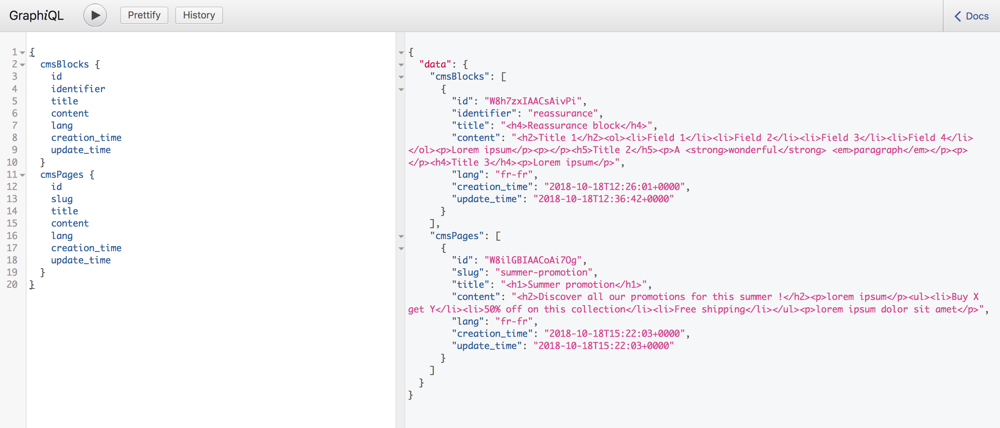

# Frequently asked questions:

#### Q: How could I test if my Vue Storefront API - Prismic Connector is retrieving my Prismic contents?
**A**: You can query both CMS blocks and pages directly from a GraphiQl client with the following requests:

* Provide your Vue Storefront API graphql url and use the following queries:
       
* Blocks query example:
```graphql
 prismicCmsBlocks {
   id
   identifier
   title
   content
   lang
   creation_time
   update_time
 }
```

* Pages query example:
```graphql
 prismicCmsPages {
   id
   slug
   title
   content
   lang
   creation_time
   update_time
 }
```



##### [> Back to summary](../summary.md)
