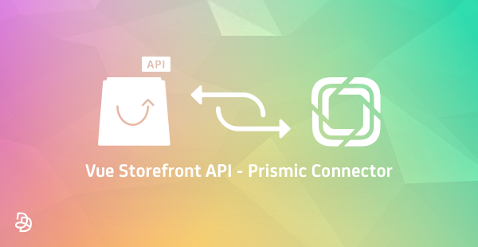

# Vue Storefront API - Prismic Connector:

Vue Storefront API - Prismic Connector is a [Vue Storefront API](https://github.com/DivanteLtd/vue-storefront-api) extension that allows you to convert the content from Prismic Headless CMS API to html for Vue Storefront.

Official extension page on the Vue Storefront forum: [Vue Storefront API - Prismic Connector](https://forum.vuestorefront.io/t/prismic-connector/160)

### Documentation:

Vue Storefront API - Prismic Connector complete documentation is available [here](doc/summary.md).

### How it works:

Vue Storefront API part of the Vue Storefront API - Prismic Connector will convert the data from the native Prismic API to html.

The conversion is based on the `slice.js` helper. For each custom type of slice it's possible to define how the html will be generated.

Natively this connector manage CMS Blocks and Pages, but you can create your own Custom Types in Prismic and use this connector to retrieve them. 

You only have to override the graphql schema and define the appropriated resolvers.

With Vue Storefront API - Prismic Connector, you can:
* Easily connect to your Prismic API
* Retrieve CMS Prismic blocks and get them from Vue Storefront API graphql API
* Retrieve CMS Prismic pages and get them from Vue Storefront API graphql API

### Requirements:

* You need a Prismic account to connect to this extension
* Vue Storefront - Prismic Connector needs to be setup on your Vue Storefront instance: [Vue Storefront - Prismic Connector](https://github.com/Agence-DnD/vue-storefront-prismic-connector)

### About us:

Founded by lovers of innovation and design, [Agence Dn'D](https://www.dnd.fr) assists companies in the creation and development of customized digital (open source) solutions for web and E-commerce since 2004.
